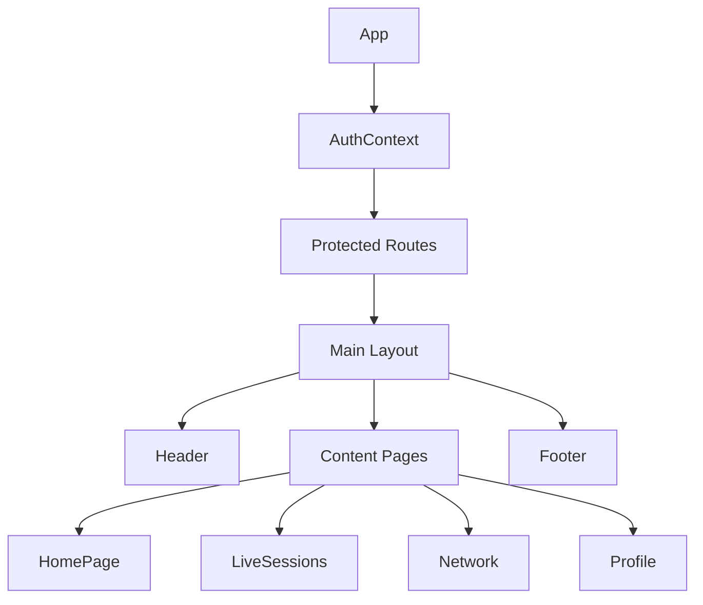

# CampusConnect - Complete Documentation

## Table of Contents
1. [Introduction](#introduction)
2. [Technical Overview](#technical-overview)
3. [User Guide](#user-guide)
4. [Architecture & Implementation](#architecture--implementation)
5. [Setup & Development](#setup--development)

## Introduction

### About CampusConnect
CampusConnect is a comprehensive event networking platform designed for university students and professionals. It bridges the gap between academic learning and professional networking by providing a unified platform for events, live sessions, and professional connections.

### Key Features
- Event Management & Participation
- Live Virtual Sessions
- Professional Networking
- Real-time Communication
- Profile Management
- Theme Customization

## Technical Overview

### Technology Stack

#### Frontend Technologies
- **React 18**
  - Modern functional components
  - Hooks-based architecture
  - Context API for state management
  - Custom hooks for reusable logic

- **Styling & UI**
  - Tailwind CSS for utility-first styling
  - Custom CSS variables for theming
  - Material Icons for consistent iconography
  - Responsive design principles

- **State Management**
  - Context API for global state
  - Local Storage for persistence
  - Custom hooks for local state

- **Routing & Navigation**
  - React Router v6
  - Protected routes
  - Dynamic route handling

### Architecture Overview

```
src/
├── components/        # Reusable UI components
├── contexts/         # Global state management
├── hooks/           # Custom React hooks
├── pages/           # Main route components
└── utils/           # Helper functions
```

## User Guide

### Getting Started

#### 1. Homepage

*Homepage in Light Mode*


*Homepage in Dark Mode*

**Key Features:**
- Event feed
- Active user status
- Quick access navigation
- Theme toggle
- Profile overview

#### 2. Live Sessions

*Live Session Interface*

**Features:**
- Video conferencing
- Screen sharing
- Chat system
- Participant management
- Quality controls
- Interactive polls

#### 3. Networking

*Networking Interface*

**Features:**
- Connection suggestions
- Profile browsing
- Connection requests
- Professional matches
- Industry filters

#### 4. User Profiles

*User Profile View*

**Key Sections:**
- Professional information
- Skills & Expertise
- Academic details
- Project showcase
- Connection stats

#### 5. Chat System

*Real-time Chat Interface*

**Features:**
- Real-time messaging
- Online status
- Message history
- Media sharing
- Group conversations

#### 6. Settings

*Settings Panel - General*


*Settings Panel - Profile*


*Settings Panel - Privacy*

**Configuration Options:**
- Profile customization
- Privacy controls
- Notification settings
- Theme preferences
- Account management

### Session Management

*Session Management Interface*

**Features:**
- Session scheduling
- Participant tracking
- Resource sharing
- Recording management

## Architecture & Implementation

### Component Structure


### Theme System
The application uses a sophisticated theming system with CSS variables:

```css
:root {
  --custom-bg: #f8fafc;
  --custom-text: #0f172a;
  /* Other theme variables */
}

.dark {
  --custom-bg: #0f172a;
  --custom-text: #f8fafc;
  /* Dark theme overrides */
}
```

### State Management
Example of Context usage:

```javascript
const ThemeContext = createContext({
  isDark: false,
  toggleTheme: () => {},
});

export const ThemeProvider = ({ children }) => {
  const [isDark, setIsDark] = useState(false);
  
  const toggleTheme = () => {
    setIsDark(!isDark);
    // Apply theme changes
  };

  return (
    <ThemeContext.Provider value={{ isDark, toggleTheme }}>
      {children}
    </ThemeContext.Provider>
  );
};
```

## Setup & Development

### Prerequisites
- Node.js v14 or higher
- npm or yarn
- Git

### Installation Steps

1. Clone the repository:
```bash
git clone [repository-url]
cd webapp.io
```

2. Install dependencies:
```bash
npm install
```

3. Create environment file:
```bash
cp .env.example .env
```

4. Start development server:
```bash
npm start
```

### Building for Production

1. Create production build:
```bash
npm run build
```

2. Test production build:
```bash
npm run serve
```

## Additional Resources

### Design System

*Application Design System Overview*

### Flow Diagram

*Application Flow Diagram*

## Contact & Support

### Technical Support
- Email: support@campusconnect.com
- Documentation: docs.campusconnect.com
- GitHub: github.com/campusconnect

### Contributing
Please read our [Contributing Guidelines](CONTRIBUTING.md) for details on our code of conduct and the process for submitting pull requests.

---

*Last Updated: October 14, 2025*